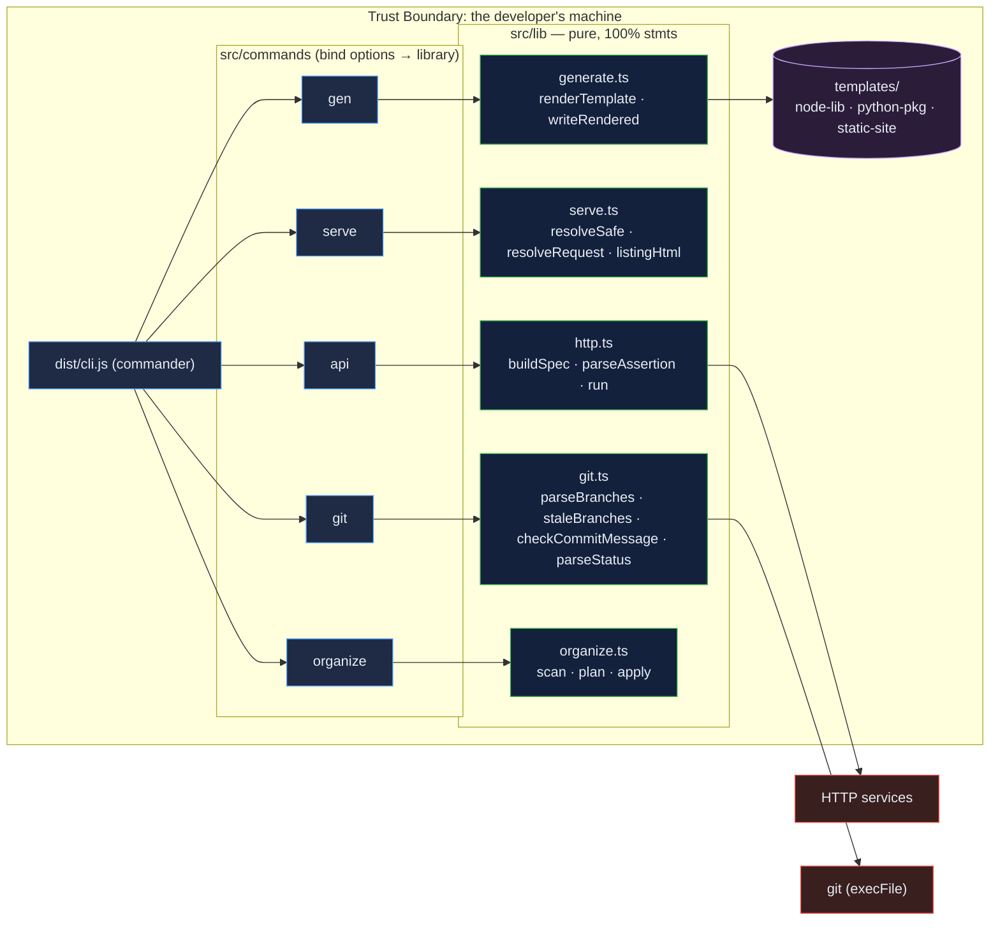

# cli-development-tools: five development chores in one tested TypeScript command

[](https://github.com/Freddricklogan/cli-development-tools/actions/workflows/deploy.yml)
[](#5-getting-started--verification)
[](https://github.com/Freddricklogan/cli-development-tools/actions/workflows/codeql.yml)
[](LICENSE)

## 1. Executive Summary & Business Impact

**Problem statement.** The repository held five scripts in two
languages with ten unpinned dependencies, spinners and prompts woven
through the logic, a 390-line dev server nobody could test, a git
helper that ran shell strings built from user input, and a file
organiser whose dry run and real run were the same loop.
None of it was tested, installable as one tool, or published
(`AUDIT.md`).

**Solution & value delivered.** `devkit`, one TypeScript command on
one runtime dependency: `api` sends a request, times it and evaluates
assertions with a meaningful exit code; `serve` serves a directory with
SPA fallback, listings and paths that cannot escape the root; `git`
lists branches with ahead/behind, finds stale branches, counts status,
and validates Conventional Commits messages as a hook; `gen` scaffolds
projects from templates without overwriting; `organize` plans category
moves and duplicate removal as a dry run and applies them safely.
Pure library modules at 100 % statement coverage, an end-to-end test on
the built binary, `npm publish --dry-run` and a CycloneDX SBOM in CI.

**[→ Read the full case study](docs/CASE_STUDY.md)**

## 2. Demonstrated Competencies & Technical Skills

- **Developer Experience** — commander-based CLI with consistent
  `--json` output and exit codes, three project templates, a
  `commit-msg`-compatible validator.
- **Supply-Chain Hygiene** — one runtime dependency, committed
  lockfile, `npm audit` on the production tree, CycloneDX 1.6 SBOM
  artefact, publish dry-run on every build.
- **Security** — traversal-safe static serving tested against encoded
  segments and NUL bytes, `execFile` with argument arrays instead of
  shell strings, never-overwrite file operations.
- **Engineering Practice** — strict TypeScript, typed ESLint, 26 Vitest
  tests, library/binding separation so logic is testable without I/O.

## 3. System Architecture & Data Flow



## 4. Technical Highlights & Engineering Decisions

### ADR-1 — Library and binding layers

**Context.** Logic interleaved with prompts and spinners could not be
tested.

**Decision.** Every decision the tool makes is a function in
`src/lib/` that takes data and returns data — a request spec, a resolved
path, a plan of moves. `src/commands/` only reads options, calls the
library and prints.

**Consequence.** 100 % statement coverage of the library with fakes
for `fetch`; the binary is exercised end to end in four tests.

### ADR-2 — One dependency

**Context.** Ten unpinned packages for colour, prompts, spinners, ASCII
art and HTTP.

**Decision.** `commander` only; `fetch`, `node:http`, `node:fs`,
`node:crypto` and `execFile` do the rest. SBOM and `npm audit` on the
production tree run in CI.

**Consequence.** The SBOM lists one component; the audit reports zero
vulnerabilities; the published tarball is 22 kB.

### ADR-3 — Safe by default

**Context.** The old server was untested; the old organiser invented
names on collision and planned while moving; the old git helper built
shell strings.

**Decision.** `resolveSafe` normalises and confines paths; `organize`
is a dry run unless `--apply`, and `apply` never overwrites; git runs
through `execFile` with an argument array.

**Consequence.** Tests pin each property, including `..`, `%2e%2e`,
`%00` and a collision that is reported rather than clobbered.

## 5. Getting Started & Verification

**Prerequisites.** Node 22.

```bash
git clone https://github.com/Freddricklogan/cli-development-tools.git
cd cli-development-tools
npm ci && npm run check                     # lint, typecheck, tests, build
npm link                                    # or: npm pack && npm i -g ./freddricklogan-devkit-1.0.0.tgz
devkit --help
devkit api https://api.github.com/repos/Freddricklogan/cli-development-tools -a status=200 -a 'json:name=cli-development-tools' -a 'time<5000'
devkit serve ./site --spa --port 8080
devkit git stale --days 30
devkit git check-commit .git/COMMIT_EDITMSG   # usable as a commit-msg hook
devkit gen python-pkg my-package --out ~/code
devkit organize ~/Downloads --dedupe          # dry run; add --apply to move files
```

**Verification — the numbers this repository actually produced:**

| Check | Result |
| --- | --- |
| Tests (Vitest) | **26 passed / 26** across 6 files (22 unit, 4 end-to-end on the built binary) |
| Coverage (`src/lib`) | **100%** statements, 86.5% branches |
| ESLint (typed), tsc --noEmit | clean |
| `npm publish --dry-run` | tarball `@freddricklogan/devkit@1.0.0`, 22.4 kB packed / 77.8 kB unpacked, 50 files |
| SBOM | CycloneDX 1.6, 1 production component |
| `npm audit --omit=dev` | 0 vulnerabilities |
| Live check | `devkit api` against the GitHub API: 200 in 513 ms, all four assertions passed |

## 6. Live Demo & Production Showcase

No web page: the artefact is a command-line package. Install from the
repository as above, or from a tarball built by `npm pack`. Publishing
to the npm registry requires an npm account and is not automated; CI
runs `npm publish --dry-run` on every build so the package is always
publishable.
